# Weather Notification System

A microservices-based weather notification system that delivers personalized weather updates to users via email. The system fetches weather data from external APIs, processes user subscriptions, and sends notifications based on user preferences.

## 📋 Services Overview

### 1. **Weather Fetcher Service** 
- **Technology**: Express.js (TypeScript)
- **Purpose**: Fetches weather data from external APIs and provides caching layer
- **Key Features**:
  - Integrates with OpenWeatherMap API
  - Redis-based caching to reduce API calls
  - RESTful API for weather data retrieval
  - Error handling and rate limiting

### 2. **Weather Scheduler Service**
- **Technology**: Node.js with cron jobs (TypeScript)
- **Instances**: 
  - Hourly Scheduler
  - Daily Scheduler
- **Purpose**: Orchestrates weather data processing and notification scheduling
- **Key Features**:
  - Cron-based scheduling (hourly: every hour, daily: 8 AM)
  - Manages user subscriptions and preferences
  - Fetches weather data for subscribed cities
  - Publishes notification messages to message queue

### 3. **Notification Sender Service**
- **Technology**: NestJS (TypeScript)
- **Instances**:
  - Hourly Notifications
  - Daily Notifications
- **Purpose**: Processes and delivers email notifications to users
- **Key Features**:
  - RabbitMQ message consumption
  - SMTP email delivery with email templates
  - Email delivery logging and status tracking
  - Rate limiting to prevent spam

## 🏗️ Application Architecture

The Weather Notification System follows a microservices architecture with the following key principles:

### **Separation of Concerns**
- **Weather Fetcher**: Handles external API integration and caching
- **Scheduler**: Manages timing and orchestration logic
- **Notification Sender**: Focuses on message delivery

### **Asynchronous Communication**
- Services communicate via RabbitMQ message queues
- Decoupled architecture allows independent scaling and maintenance
- Message persistence ensures reliability

### **Data Persistence**
- **MongoDB**: Stores user subscriptions, preferences, and email logs
- **Redis**: Caches weather data to reduce external API calls
- **RabbitMQ**: Message persistence and queue management

### **Scalability & Reliability**
- Horizontal scaling through Docker containers
- Health checks and service dependencies
- Separate instances for different notification frequencies
- Graceful error handling and logging

## 🔄 System Architecture Diagram

```mermaid
flowchart LR
    %% External Layer - Left Side
    subgraph EXT["🌐 External Layer"]
        direction TB
        ExtAPI["🌤️ OpenWeatherMap API<br/>External Weather Data"]
        User["👥 Users & Subscribers<br/>Email Recipients"]
    end
    
    %% Weather Fetcher - Center Left
    WF["📡 Weather Fetcher<br/>🔧 Express.js<br/>🗄️ Caches Data"]
    
    %% Scheduler Services - Center
    subgraph SCHED["📅 Scheduler Services"]
        direction TB
        WSH["⏰ Hourly Scheduler<br/>🔄 Every Hour"]
        WSD["📆 Daily Scheduler<br/>🌅 8:00 AM Daily"]
    end
    
    %% Infrastructure - Center Bottom
    subgraph INFRA["🏗️ Infrastructure"]
        direction LR
        Redis[("⚡ Redis<br/>Cache")]
        MongoDB[("🍃 MongoDB<br/>Database")]
        RabbitMQ[("🐰 RabbitMQ<br/>Message Queue")]
    end
    
    %% Notification Services - Right
    subgraph NOTIFY["📧 Notification Services"]
        direction TB
        NSH["📬 Hourly Notifications<br/>🚀 NestJS Handler"]
        NSD["📮 Daily Notifications<br/>🚀 NestJS Handler"]
    end
    
    %% Clear Data Flow Connections
    WF -.->|"🌡️ Fetch Weather"| ExtAPI
    WF -->|"💾 Store Cache"| Redis
    WF -->|"📊 Read Cache"| Redis
    
    WSH -->|"📊 Request Weather"| WF
    WSD -->|"📊 Request Weather"| WF
    
    WSH -->|"👥 Query Users"| MongoDB
    WSD -->|"👥 Query Users"| MongoDB
    
    WSH -->|"📤 Send Message"| RabbitMQ
    WSD -->|"📤 Send Message"| RabbitMQ
    
    RabbitMQ -->|"⚡ Deliver Hourly"| NSH
    RabbitMQ -->|"📅 Deliver Daily"| NSD
    
    NSH -->|"📧 Send Email"| User
    NSD -->|"📧 Send Email"| User
    
    NSH -->|"📝 Write Log"| MongoDB
    NSD -->|"📝 Write Log"| MongoDB
    
    %% Enhanced Styling
    classDef serviceBox fill:#e3f2fd,stroke:#1976d2,stroke-width:3px,color:#000
    classDef schedulerBox fill:#f3e5f5,stroke:#7b1fa2,stroke-width:2px,color:#000
    classDef notificationBox fill:#e8f5e8,stroke:#388e3c,stroke-width:2px,color:#000
    classDef cacheDb fill:#fff3e0,stroke:#f57c00,stroke-width:3px,color:#000
    classDef docDb fill:#fce4ec,stroke:#c2185b,stroke-width:3px,color:#000
    classDef messageQueue fill:#f1f8e9,stroke:#689f38,stroke-width:3px,color:#000
    classDef external fill:#ffebee,stroke:#d32f2f,stroke-width:3px,color:#000
    classDef groupStyle fill:#f8f9fa,stroke:#6c757d,stroke-width:2px,stroke-dasharray: 5 5
    
    class WF serviceBox
    class WSH,WSD schedulerBox
    class NSH,NSD notificationBox
    class Redis cacheDb
    class MongoDB docDb
    class RabbitMQ messageQueue
    class ExtAPI,User external
    class EXT,SCHED,NOTIFY,INFRA groupStyle
```

## 🚀 Data Flow

1. **User Subscription**: Users subscribe to weather notifications for specific cities with preferred frequency (hourly/daily)

2. **Scheduled Processing**: 
   - Cron jobs trigger weather processing based on frequency
   - Scheduler queries MongoDB for active subscriptions
   - Groups users by city to optimize API calls

3. **Weather Data Retrieval**:
   - Scheduler requests weather data from Weather Fetcher Service
   - Weather Fetcher checks Redis cache first
   - If cache miss, fetches from external API and caches result

4. **Notification Queuing**:
   - Scheduler creates notification messages for each user
   - Messages are published to RabbitMQ queues (separate queues for hourly/daily)

5. **Email Delivery**:
   - Notification Sender Services consume messages from queues
   - Generate HTML email templates with weather data
   - Send emails via SMTP with rate limiting
   - Log delivery status to MongoDB

## 🛠️ Infrastructure Components

### **Message Queuing (RabbitMQ)**
- **Exchange**: `weather_notifications`
- **Queues**: Separate queues for hourly and daily notifications
- **Features**: Message persistence, acknowledgments, prefetch control

### **Caching (Redis)**
- **TTL**: 30 minutes for weather data
- **Key Pattern**: `weather:{city_name}`
- **Purpose**: Reduce external API calls and improve response times

### **Database (MongoDB)**
- **Collections**:
  - `subscriptions`: User subscription data
  - `emailnotificationlogs`: Email delivery logs
- **Features**: User preferences, delivery tracking, analytics

### **Containerization (Docker)**
- Each service runs in isolated containers
- Health checks ensure service availability
- Volume mounts for development
- Environment-based configuration

## 📊 Key Features

- **Multi-frequency Notifications**: Support for both hourly and daily weather updates
- **Intelligent Caching**: Redis caching reduces external API dependency
- **Reliable Message Processing**: RabbitMQ ensures message delivery
- **Email Templates**: Rich HTML email formatting with responsive design
- **Delivery Tracking**: Complete audit trail of email deliveries
- **Rate Limiting**: Prevents service abuse and API quota exhaustion
- **Health Monitoring**: Service health checks and dependency management
- **Horizontal Scalability**: Microservices architecture supports independent scaling

## 🔧 Development Setup

1. **Prerequisites**: Read DOCKER_GUIDE.md

